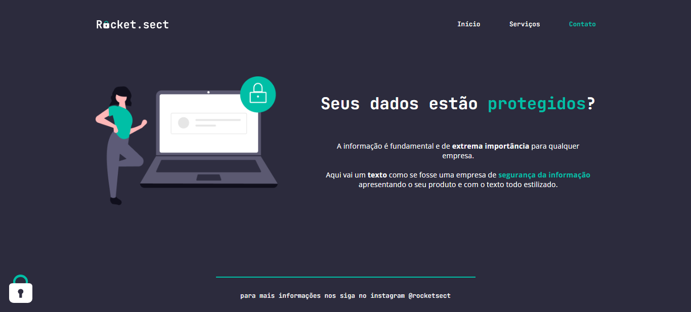

  

	
<h4 align="center"> 
	🚀 Projeto 03 | Stage 02 - Explorer
</h4>

  

  
  
  
  
  <a href="https://laurirodrigues.github.io/Page-Rocket.sect/"> ▶️ Visualizar Deploy </a>

<h2 align=left> 💻 Sobre o projeto </h3>

 Página feita durante o programa <strong>Explorer</strong> da <a href="https://www.rocketseat.com.br/"> <strong>Rocketseat</strong> </a>. É o terceiro projeto do nível 2 do programa, é um desafio onde construímos uma página simples para fixação de conceitos de HTML e CSS vistos em aula.

  
<h2 align=left> 🛠 Tecnologias utilizadas </h3>

  
  

<h2 align=left> 🎨 Layout </h2>
<a href="https://www.figma.com/file/DPUMAJQrYujLUF5EU0qCr4/Explorer-(Copy)?node-id=16%3A106"> Visualizar no Figma </a>

<h4>💻 Desktop </h4>

